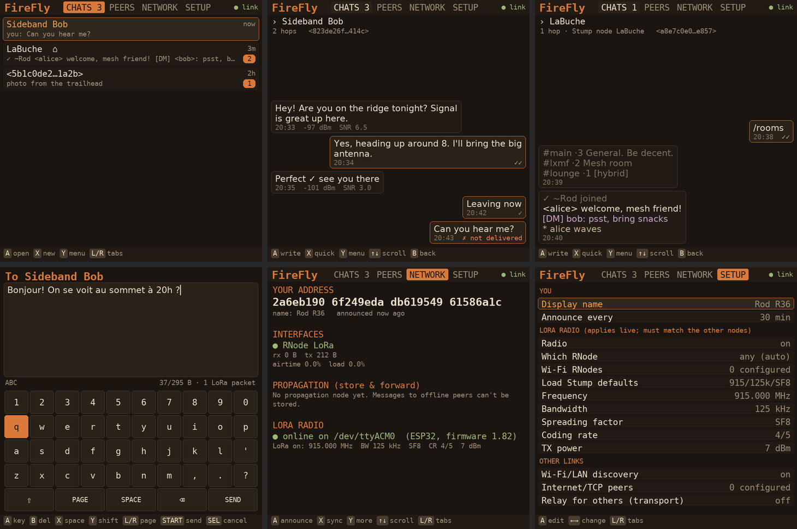

# FireFly

A gamepad-driven [Reticulum](https://reticulum.network) messenger for RK3326
handhelds (R36MAX, R36S and friends), built for **LoRa first**.
(Formerly RetiCom.)

FireFly speaks standard **LXMF**, so it talks to anyone on Reticulum:
Sideband, Nomad Network, MeshChat, and other LXMF clients, over LoRa, Wi-Fi/LAN or the
internet, all at once. It also understands LaBuche-Stump nodes (see below),
but nothing in it depends on them.

It uses the official Python `rns` and `lxmf` libraries, not a
re-implementation, so compatibility comes from the reference code itself.

**Status:** v0.6.2. Runs on RK3326 handhelds with the dArkOS image of
[arkos4clone](https://github.com/lcdyk0517/arkos4clone); tested on an R36MAX.
See [Supported devices](#supported-devices).

## Install

Full step-by-step guide: **[INSTALL.md](INSTALL.md)**. In short:

1. Flash RNode firmware onto a LoRa board (`rnodeconf --autoinstall`) and
   plug it into the handheld's USB.
2. Download `firefly_vX.Y.Z.zip` from the [latest release](https://github.com/ruderigo/FireFly_RK3326_R36MAX_R36S/releases/latest) and copy it
   to the handheld with `scp` (or download it on the handheld with `wget`).
3. Over SSH, unpack it to a temporary folder and run
   `deploy/cleanup.sh`, then `deploy/install.sh`. Reboot.

The release zip holds the `firefly/` folder of this repository at that
version: the zip is what you copy to the handheld, the folder is there to
read and browse.
4. Open **Ports → FireFly**.

The installer uses prebuilt Debian packages (nothing compiles), keeps the
app in `/home/ark/firefly` and your data in `/home/ark/.firefly`, and adds a
Ports entry.

**Updating** replaces only the app: your identity, contacts and messages
stay. **Rolling back** is installing an earlier zip from the repository
history the same way. Both
are described in [INSTALL.md](INSTALL.md#8-updating-to-a-new-version).

## Supported devices

FireFly runs on **RK3326 handhelds using the dArkOS image of
[arkos4clone](https://github.com/lcdyk0517/arkos4clone)** (Debian-based).
It needs Python 3.9+ and pygame 2, which that image provides. The older
**ArkOS** image is not supported: its system is too old, and the installer
stops with a message saying so.

The table covers every device in arkos4clone's dArkOS image, grouped by the
screen size in its device tree. Names are the ones arkos4clone's DTB selector
uses.

| Screen | FireFly draws at | Devices |
|---|---|---|
| 640×480 | 640×480 | `a10mini`, R36S original and clone panels, `d007`, `dc35v`, `g350`, `hg36`, `k36`, `k36s`, `mymini`, `o30s`, `r33s`, `r36h`, `r36pro`, `r36t`, `r36xx`, `rf35h`, `rg351mp`, `rg351v`, `rg36`, `rg36pro`, `rgb10x`, `rgb20s`, `rp1`, `rs16`, `rx6h`, `sauce`, `v21`, `xf35h`, `xgb36`, `xu10` |
| 720×720 | 720×720 | **`r36max`** (tested), `dc40v`, `mini40`, `r36splus`, `r36tmax`, `r36ultra`, `rf40h`, `t16max`, `xf40h`, `xf40v` |
| 1024×768 | 1024×768 | `dc45v`, `go2`, `h7`, `r36hpromax`, `r36max2`, `r36ultrax`, `r40xx`, `r40xxpromax`, `r45h`, `r46h`, `rf45h`, `rf45v`, `xf45v` |
| 720×540 | 720×540 | `a10miniv4` |
| 480×854 portrait | 854×480, rotated | `r50s`, `rgb10max` |
| 480×800 portrait | 800×480, rotated | `r40s`, `u8` |
| 480×640 portrait | 640×480, rotated | `dr28s`, `xf28` |
| 320×480 portrait | 480×320, rotated | `rg351p`, `rgb10`, `rgbv10` |
| 720×1280 portrait | 1280×720, rotated | `r50h`, `rf55h` |

Only the R36MAX has been tested on hardware so far. Every other row has
been checked by rendering FireFly at that exact screen geometry
(`tests/devices.py`); please report how it runs on yours.

**Sideways panels.** Several handhelds use a portrait LCD turned on its
side. When the screen reports a portrait size, FireFly rotates its picture
to landscape automatically. If it comes up sideways or upside down on your
device, press **Select + R1** to turn it 90° at a time; the choice is
saved. It's also under SETUP → Screen rotation.

**Buttons.** FireFly uses the controller mapping the firmware provides. On a
pad without one, `launch.log` lists the raw button numbers, and you can map
them in `~/.firefly/settings.json` (see INSTALL.md, Troubleshooting).

**LoRa radio.** Any RNode works: FireFly finds it on whichever USB port it
appears, or over Wi-Fi if you add the RNode's address in SETUP. A USB radio
needs USB host support and a kernel driver for the board's USB chip
(CP2102, CH340 or native USB), which depends on each device's kernel. Without
a radio, FireFly still works over Wi-Fi/LAN and the internet.

**Reporting a device.** Run `bash ~/firefly/deploy/device_report.sh` and
paste the output into an issue, whether it works or not.

## Your identity

Your address is derived from a private key stored in
`~/.firefly/identity`. **Whoever holds that file is you on the network, and
if it's lost, so is your address.** Back it up right after installing
([INSTALL.md, section 7](INSTALL.md#7-back-up-your-identity-do-this-now)),
and keep the copy private.

Handhelds are often switched off by holding the power button, which cuts
power before recently written files reach the SD card. FireFly protects
the key against that:

- **Safe writes.** The key is written to a temporary file, flushed to the
  card with `fsync`, then renamed into place, so it is never half-written.
- **A second copy.** `identity.bak` is kept next to it, written the same way.
- **Checks on every start.** A key file that is the wrong size or blank
  (zero-filled, the typical power-loss damage) is rejected rather than
  loaded as a different key.
- **Automatic repair.** If the main key is damaged and the backup is good,
  FireFly restores it and says so on the NETWORK tab.
- **Never a silent new address.** If both copies are unreadable, the
  damaged file is kept as `identity.damaged-<time>`, a new identity is
  created, and the NETWORK tab warns that your address changed. Restore
  your backup (INSTALL.md, section 10) to get the old address back.
- **Clean exits flush everything.** Quitting (Select + Start) writes all
  pending data to the card.

The installer and `cleanup.sh` never delete a key without backing it up
first (`~/firefly-backup-<date>/`), and a clean reinstall keeps your address
and settings unless you ask for a new identity or a factory reset.

**Coming from RetiCom?** Install FireFly as a normal update
([INSTALL.md, section 8](INSTALL.md#8-updating-to-a-new-version)). The
installer moves your data from `~/.reticom` to `~/.firefly`, so you keep
the same address, contacts and messages, and it removes the old app and
Ports entry.

## What works

- **Identity**: created on first start, kept in `~/.firefly/identity`. That
  key *is* your address: back it up.
- **Discovery**: peers appear as they announce, with their display names and
  hop count. Add anyone by their 32-hex LXMF address too.
- **Messages**: end-to-end encrypted LXMF, with delivery states:
  `…` pending, `⚙` generating a stamp, `↑` sending, `✓` sent,
  `✓✓` delivered (proof received), `✓ node` stored on a propagation node,
  `✗` failed (with the reason).
- **LoRa-aware sending**: short messages go as a single packet (no link
  setup, least airtime). The composer shows the size against the one-packet
  limit (295 bytes). Longer messages switch to a link automatically.
- **Offline delivery**: picks the nearest propagation node heard (or one you
  choose). If a peer can't be reached, the message is handed to the node.
  Messages waiting for you are fetched at start and on a timer.
- **Interoperability details**: stamps requested by a peer's announce are
  generated automatically; duplicate messages (direct + via node) are dropped;
  voice notes (Opus and Codec 2) are played and copied to the SD card; images,
  files and telemetry sent from Sideband are listed as
  `[image — not shown on this device]` rather than lost silently; messages whose
  signature couldn't be verified are flagged.
- **Any RNode, found at runtime**: the radio isn't part of start-up.
  FireFly starts without it, then looks for an RNode on every USB serial
  port and on any Wi-Fi RNodes you list, and uses the first that answers.
  Plug, unplug or swap boards while it runs; it notices and searches again.
- **Radio settings apply live**: frequency, bandwidth, spreading factor,
  coding rate and TX power retune the radio a moment after you change them,
  with no restart. One press loads the Stump network defaults
  (915.0 MHz / 125 kHz / SF8 / 4/5 / 7 dBm).
- **Clear radio status**: online (with the board's chip and firmware), no
  radio plugged in, searching, or *refused*: an RNode answered but won't use
  these settings (for example a frequency outside its band), or its firmware
  is too old. An old-firmware RNode is reported instead of stopping the app.
- **Network screen**: your address, every interface with traffic counters and,
  for the RNode, RSSI / SNR / noise / airtime / channel load; propagation
  node and sync status; the Reticulum log.
- **Typing**: on-screen keyboard (letters, symbols, French accents),
  quick replies, and any USB keyboard on the hub works at the same time.
- **Headless mode** for testing over SSH: `python -m firefly --headless`.

## Stump foundations

A Stump node is an ordinary LXMF peer, so chatting with one already works.
On top of that, `firefly/stump.py` provides:

- detection from the `stump.node` beacon (and an on-demand path request when
  a new peer is heard); Stump nodes are marked ⌂ in the lists,
- a parser for the line protocol: room messages, `/me`, the activity symbols
  (✓ ✗ ✎ → ⊖), `[DM] <author>: text`, `/rooms` with `[minted]`/`[hybrid]` tiers,
- the `/auth` handshake: standard Reticulum identity key (128 hex),
  Ed25519 signature over the nonce's ASCII text, answer kept to one packet
  (263 of 295 bytes, empty title, no fields, opportunistic, never via a
  propagation node), a single challenge in flight, restart on expiry,
- Stump's nick cleaning rules (the name editor shows your Stump nick).

In a chat with a Stump node, lines are coloured by meaning (DMs purple,
activity dim) and the peer menu offers *verify my identity*, `/rooms` and
`/names`. Rooms/DM thread views are the next step.

## Controls

| Button | Lists | Chat | Keyboard |
|---|---|---|---|
| D-pad | move | scroll | move |
| A | open / select | write | type key |
| B | back | back | delete |
| X | tab action (new chat / save / sync) | quick replies | space |
| Y | menu | peer menu | shift |
| L1 / R1 | switch tabs | page up / latest | keyboard page |
| Start | | write | send |
| Select | | | cancel |
| Select + Start | quit | quit | |
| Select + R1 | rotate the screen 90° | rotate | |

On a desktop: arrows, Z/Enter = A, X/Esc = B, S = X, A = Y, Q/W = L1/R1,
Space = Start, Tab = Select.

## Files

The app lives in `/home/ark/firefly` (code, `venv/`, `launch.log`).
Your data lives in `~/.firefly/` (override with `FIREFLY_HOME`), which
updates never touch:

| File | What it is |
|---|---|
| `identity`, `identity.bak` | your private key and its safety copy |
| `settings.json` | your settings |
| `firefly.db` | contacts and messages (SQLite) |
| `lxmf/` | LXMF router state |
| `reticulum/config` | Reticulum config for Wi-Fi/LAN and TCP links, generated from the settings on every start (set `"managed_config": false` to use `~/.reticulum` instead). The radio isn't in it: FireFly attaches it at runtime. |

If an `rnsd` shared instance is already running, FireFly uses it, and
rnsd's own config decides the interfaces.

## Repository layout

    README.md, INSTALL.md, CHANGELOG.md
    docs/                  screenshots
    firefly/
      deploy/              install.sh, cleanup.sh, device_report.sh, FireFly.sh (Ports launcher)
      firefly/             the Python package
      tests/               integration and UI tests

## Development

Runs on any desktop with Python 3.10+, from the `firefly/` folder:

    pip install "rns==1.5.6" "lxmf==1.2.0" pygame   # plus opus-tools and codec2 for voice notes
    python3 -m firefly                  # window, keyboard controls
    python3 -m firefly --window 640x480 # preview a smaller screen
    python3 -m firefly --headless       # no window

## Tests

From the `firefly/` folder:

    python3 tests/run_integration.py   # LXMF round trips, links, Stump /auth, over localhost TCP
    python3 tests/run_propagation.py   # offline peer: fallback to a propagation node
    python3 tests/run_radio.py         # radio manager against simulated RNodes (no hardware needed)
    python3 tests/run_voice.py         # voice notes: Codec 2 spec test vector, Opus, SD copy (needs opusdec, c2dec)
    python3 tests/run_block.py         # delete and block, across a restart
    python3 tests/run_chat_selector.py # chat selector: any voice note, details, new arrivals
    python3 tests/ui_smoke.py          # 6000 random button presses through every screen
    python3 tests/screens.py 720x720 /tmp/shots   # screenshots of every screen
    python3 tests/devices.py /tmp/devshots        # every supported screen geometry, incl. rotated panels

## Known limits

- Voice notes are received and played, not recorded or sent. Images and files
  are listed, not shown or sent.
- Stamp generation is slow on the Cortex-A35: messages to peers that demand
  high stamp costs can sit at `⚙` for a while.
- No Bluetooth: the RNode must be on USB (or reachable over TCP).

## Credits

FireFly builds on [Reticulum](https://github.com/markqvist/Reticulum) and
[LXMF](https://github.com/markqvist/LXMF) by Mark Qvist (Reticulum License)
and [pygame](https://www.pygame.org) (LGPL). Colour palette after the
[LaBuche-Stump](https://github.com/ruderigo/LaBuche-Stump) project's Amber
theme.
